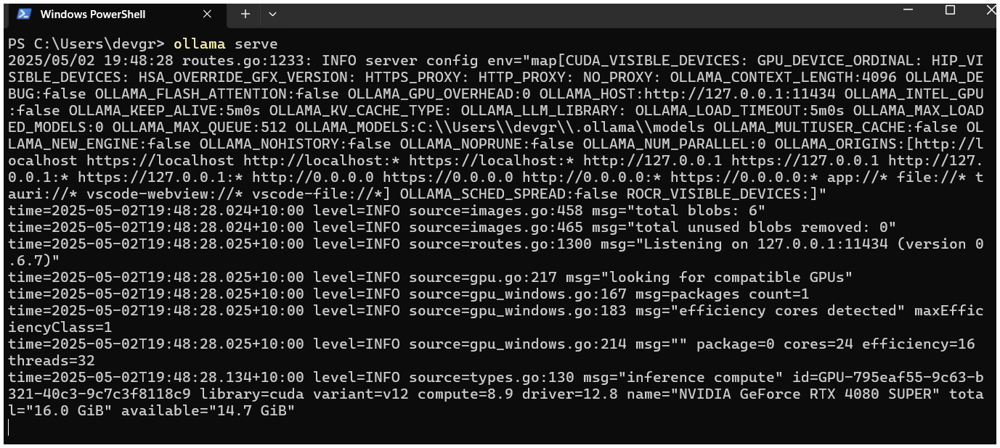
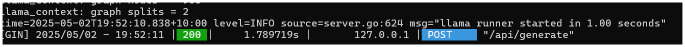
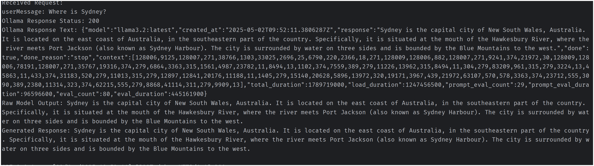
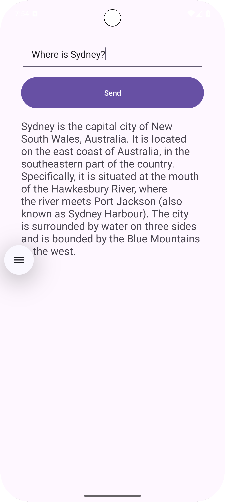
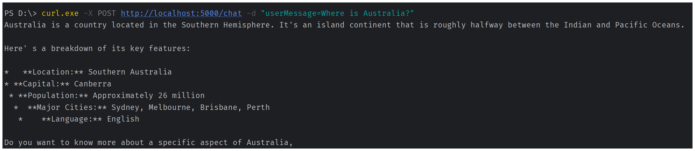
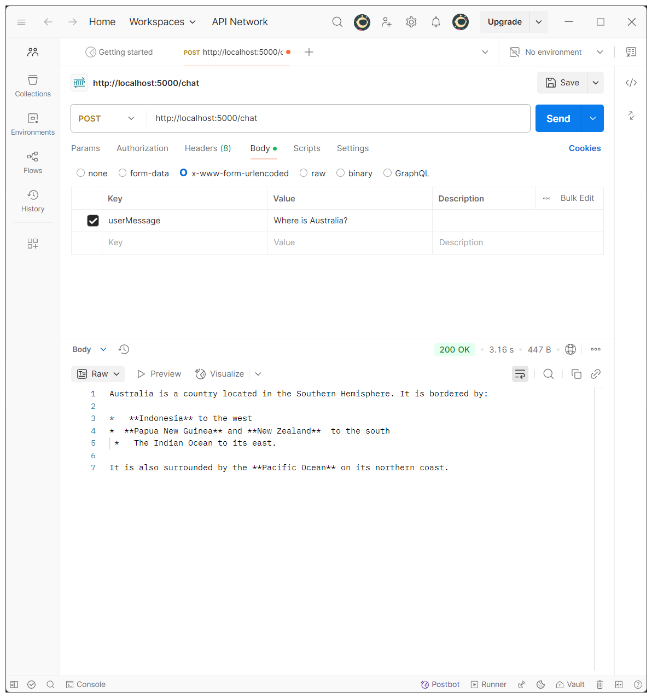
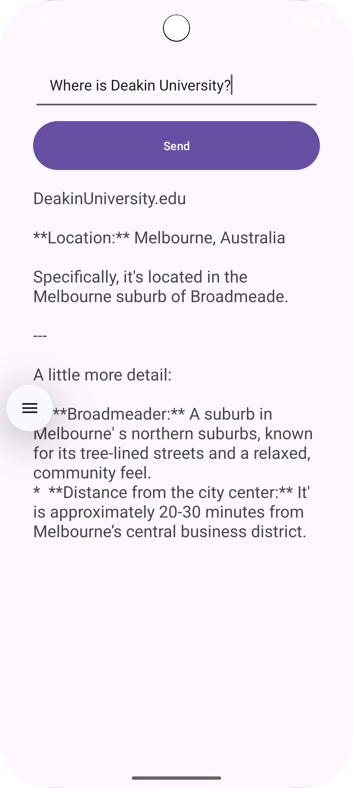

# Backend Code For Task 8.1C 
For frontend sample android app: https://github.com/dgdeakin/Task8.1CAndroidAppExample

# Files
Three files are present, use the file that works for you (Feel free to edit).
1. main-directModel.py
2. main-pipeline.py
3. main-ollama.py (Need to download ollama, may skip steps 4, 5)

You can explore code from previous year from here:
https://github.com/sit3057082025/T-8.1C. 
Readme file is useful.

# Instructions:
- Almost similar to previous setups as in Task6.1D Backend code setup.
- Detailed steps are in ReadME of this repo:
https://github.com/sit3057082025/BackendApiLLM_T6.1D

## 1. First clone the repo or download to your local folder.
## 2. Run terminal in the project folder.
   - Make sure python is installed. https://www.python.org/downloads/
   - Create Virtual environment using this in terminal: ```python -m venv venv```
   - venv folder will be created.
   - now activate virtual environment
     - For MAC:
        ```source venv/bin/activate```
     - For Windows PS:
       ```.\venv\Scripts\Activate.ps1```
## 3. Now install the libraries
   - ```pip install Flask```
     (source: https://flask.palletsprojects.com/en/stable/installation/)
   - ```pip install accelerate```
   - ```pip install requests```
   - ```pip install transformers```
     (source: https://pypi.org/project/transformers/)
   - ```pip3 install torch torchvision torchaudio --index-url https://download.pytorch.org/whl/cu126```
     (source: https://pytorch.org/get-started/locally/)
## 4. Settings with HuggingFace
   - Signup for Huggingface Account here: https://huggingface.co/
   - Create access token from here: https://huggingface.co/settings/tokens
   - Get Model "google/gemma-3-1b-it" from https://huggingface.co/google/gemma-3-1b-it.
      Acknowledge licence.

   

   - Then run this in terminal:
     ```huggingface-cli login```

   - It will ask for hugging face token, provide and press enter. Then select Y.
     
## 5. To run the code (In Terminal): 
```python main-directModel.py```

or 

```python main-pipeline.py```


# 6. Using python main-ollama.py
a) First download and install ollama from: https://ollama.com/download

b) In your new terminal, run:
   - ```ollama serve```
   - You should get:
   
   

c) Then, in your backend (this project) terminal, run
   ```python main-ollama.py```
   
d) Then, either test the route points in postman as below (Steps 7a, 7b).

e) Or run the android app.

f) On successful run you should get:

  - in Ollama serve terminal


   


   - in your backend terminal,




   
   - in you android app,




# 7. To retrieve check response:
## a) Using curl in terminal PS (as shown in image below):
- PS D:\> curl.exe -X POST http://localhost:5000/chat -d "userMessage=Where is Australia?"
  


## b) using PostMan (as shown in image below)
METHOD: POST

URL: http://localhost:5000/chat

Body: x-www-form-urlencoded
- key: userMessage
- Value: Where is Australia?





# c) In Sample Android app:
- Use JsonRequest or other tools:




# 8. Troubleshooting
1. port 5000 may not be available sometimes, use different post like 5001. Change in android app as well the port number.
2. Make sure to run  "huggingface-cli login" command in terminal and provide token.
3. Make sure to acknowledge licence in the model site such as https://huggingface.co/google/gemma-3-1b-it
4. Select most permissions while creating access token.
5. Try with different models based on quick access. https://huggingface.co/models
6. Use small models.

# 9. Good to know about:
1. Python https://www.python.org/
2. Virtual Environments https://docs.python.org/3/library/venv.html
3. Flask https://flask.palletsprojects.com/en/stable/
4. Huggingface Transformers https://huggingface.co/docs/transformers/en/index

Further references (From Previous)
[https://github.com/sit3057082025/T-8.1C](https://github.com/sit3057082025/T-8.1C)
