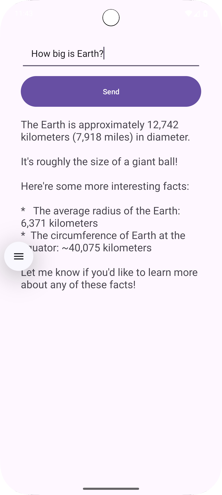

# Files
Two files are present, use the file that works for you.

You can explore code from previous year from here:
https://github.com/sit3057082025/T-8.1C

Readme file is useful.

# Instructions for this file:
- Almost similar to previous setups as in Task6.1D Backend code setup.

# Create virtual Env
- python -m venv venv
- Activate virtual environment
- Then install as below.

# pip installs
- pip install Flask
- pip install transformers
- pip install accelerate

For Pytorch:
- pip3 install torch torchvision torchaudio --index-url https://download.pytorch.org/whl/cu128

(Source: https://pytorch.org/get-started/locally/)

# To Run the Code:
python main-directModel.py 
or 
python main-pipeline.py

# To retrieve check response:
## Using curcl in terminal PS:
- PS D:\> curl.exe -X POST http://localhost:5000/chat -d "userMessage=Where is Australia?"
- 

## using PostMan
METHOD: POST
URL: http://localhost:5000/chat
Body: x-www-form-urlencoded
key: userMessage
Value: Where is Australia?

# In Sample Android app:
- Use JsonRequest or other tools:

